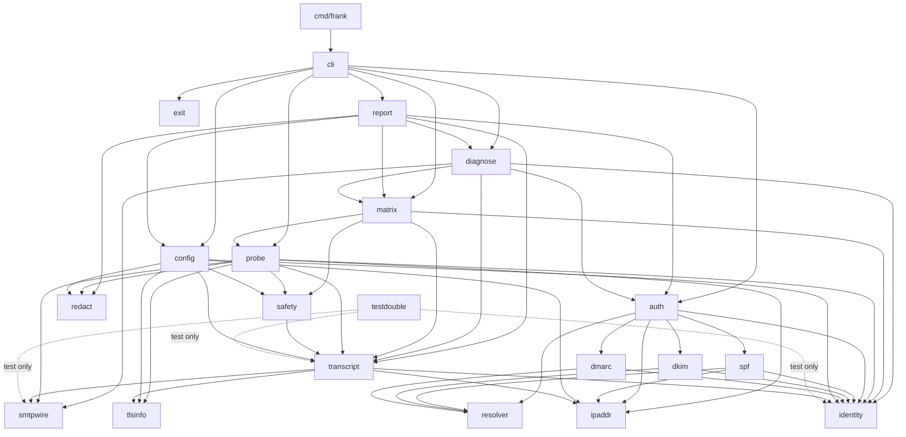

# Frank — package layout and core types

Design only. No implementation. Module `github.com/MatrixMagician/Frank`, binary `frank`,
Go 1.26, standard library only, no CGO, no third-party modules (issue #1).

Vocabulary is [CONTEXT.md](../../CONTEXT.md) and it wins over [SPEC.md](../../SPEC.md).
Every capitalised domain word below (Probe, Transcript, Phase, Outcome, Verdict, Diagnosis,
Cell, Identity Slot, Identity Triple, Envelope Sender, HELO Identity, Header From, Recipient,
Source Address, Candidate Sending IP, Evaluation Tree, Matched Mechanism, Lookup Limit,
Alignment, Selector Discovery, Acceptance, Rejection, Deferral) is used in the glossary's sense
and appears in the code under that name.

---

## 0. The four principles, and where each one changed a choice

Stated up front so the rest reads as consequences rather than taste. Each is expanded at the
point of use.

| Principle | Where it changed a choice |
|---|---|
| model-the-domain | `Phase` is a closed enum with a step table, not a chain of `if`s (§2). `OutcomeClass` gained `Progress` because the glossary defines Acceptance as *2xx to end-of-data only* (§4.1). The Evaluation Tree is one flat ordered slice with depth, not a nested tree plus a flattened copy (§8.1). `--dry-run` became `StopAfter Phase`, deleting a `dryRun bool` from six call sites (§4.4). `Redactor` is a null object so no `if redactor != nil` exists anywhere (§9). |
| type-system-discipline | `SourceAddress` and `CandidateSendingIP` are different types with unexported fields and no conversion from hypothesis back to observation (ADR-0002, §5). `Recipient` is not an Identity Slot, so `identity.Triple` structurally cannot hold one and `matrix` cannot vary it. `CellState`'s zero value is `Unrun`, so an untouched Cell is correct by construction (§4.4). `exit.Status` makes "success with an error" and "failure without a message" unrepresentable (§6). `safety.Rate` cannot be constructed above the default, so `matrix` cannot raise it (issue #6, #12). `redact.Secret` marshals to `"[redacted]"` and only `Reveal()` exposes it (ADR-0007). |
| laziness-protocol | No `pkg/`, no plugin registry, no `Store`/`Repository` interfaces, no writer interface with one implementation. The zone fixture lives *in* `internal/resolver` rather than in its own package. Send gating, rate limiting and back-off are one package because they are one ticket (#6). SASL PLAIN/LOGIN encoding is three functions in `smtpwire`, not a mechanism interface. `Reply.Multiline` was deleted: `len(Lines) > 1` already says it, and a redundant boolean can disagree with the data. |
| boundary-discipline | Exactly four packages touch the outside world: `cli` (argv, env, TTY, stdout), `config` (file read), `probe` (sockets), `resolver` (DNS). Everything under them is pure and table-testable. `config.Resolve` is a pure function taking already-read inputs, so the precedence rules are tested without a filesystem or a `flag.FlagSet`. Only `cmd/frank/main.go` calls `os.Exit`. Only `ipaddr` constructs a `netip.Addr` from untrusted input, which is what makes ADR-0006's `.Unmap()` impossible to forget. |

---

## 1. Package tree

```
github.com/MatrixMagician/Frank
├── go.mod                       module + `go 1.26`; no require block, ever
├── cmd/
│   └── frank/
│       └── main.go              ~5 lines: the only os.Exit in the tree
└── internal/
    ├── exit/                    Code, Completion, Status                      #1 #4 #12 #13 #14
    ├── identity/                Identity Slots, Identity Triple, Recipient,
    │                            Domain, Domain Pair                            #4 #12
    ├── ipaddr/                  Source Address, Candidate Sending IP,
    │                            normalization and zone rejection                #8 (ADR-0002/0006)
    ├── smtpwire/                reply parsing, EHLO extensions, dot-stuffing,
    │                            SASL encoding                                   #2 #4 #11 (ADR-0001)
    ├── tlsinfo/                 TLS mode, captured chain, separate verification #5 (ADR-0004)
    ├── redact/                  Redactor, redaction Summary                     #2 #11
    ├── safety/                  Rate, RateLimiter, BackOff, thresholds          #6 #12
    ├── resolver/                Resolver seam, System, Fixture, Existence       #7
    ├── transcript/              Transcript, Event, Phase, Kind, Detail,
    │                            Outcome, PhaseRecord, Clock                     #2 #4
    ├── config/                  JSON File (pointer fields), Settings, Resolve   #14 (ADR-0005/0007)
    ├── spf/                     record parse, Evaluation Tree, Lookup Limit,
    │                            Matched Mechanism, SPF Verdict                  #8
    ├── dkim/                    key record parse, Selector Discovery            #9
    ├── dmarc/                   policy parse, Alignment                         #10
    ├── auth/                    the Verdict for a Domain Pair (spf+dkim+dmarc)  #8 #9 #10
    ├── probe/                   the controlled ESMTP conversation, one Probe    #4 #5 #6 #11
    ├── matrix/                  Axes, Cell, CellState, the sweep                #12 (ADR-0003)
    ├── diagnose/                Diagnosis, Observation, Computation             #13
    ├── report/                  the combined Report, text and JSON renderers,
    │                            output directory                               #2 #14
    ├── cli/                     flags, subcommand routing, exit mapping         #1 #6 #14
    └── testdouble/              in-process scriptable SMTP server               #3
```

Everything is under `internal/` deliberately: Frank is "entirely standalone, no coupling to any
other tool" (SPEC non-goals), so nothing should ever be importable. There is no `pkg/`.

### 1.1 What each package owns

| Package | Owns | Must not contain | Issues |
|---|---|---|---|
| `cmd/frank` | `main`, the single `os.Exit` | anything else | #1 |
| `exit` | the 0/1/2/3/4 model as types | knowledge of Probes, Cells or DNS | #1 #4 #12 #13 #14 |
| `identity` | the three Identity Slots as three distinct types, `Triple`, `Recipient`, `Domain`, `DomainPair`, their parsers and normalisation | anything network | #4 #12 |
| `ipaddr` | `SourceAddress`, `CandidateSendingIP`, `Provenance`, the only `netip` parsing in the tree | SPF semantics | #8 |
| `smtpwire` | `ReplyCode`, `EnhancedStatus`, `Reply`, the multiline reader, `Extensions`, dot-stuffing, SASL PLAIN/LOGIN encoding | sockets, TLS, policy | #2 #4 #11 |
| `tlsinfo` | `Mode`, `Details`, `Certificate`, `Verification`, the `tls.Config` factory ADR-0004 mandates, and the separate `x509` verification | SMTP verbs | #5 |
| `redact` | `Redactor` (null-object), `Summary` | rendering | #2 #11 |
| `safety` | `Rate` (unraisable), `RateLimiter`, `BackOff`, Deferral abort threshold | send gating semantics (those need a Phase; they live in `config`/`probe`) | #6 #12 |
| `resolver` | the seam interface, `System` (PreferGo, StrictErrors), `Fixture`, `Existence`, `Error` kinds, `QueryRecord` | SPF/DKIM/DMARC syntax | #7 |
| `transcript` | the spine: `Transcript`, `Event`, `Phase`, `Kind`, the `Detail` union, `Outcome`, `PhaseRecord`, `Clock` | I/O, rendering, redaction | #2 #4 |
| `config` | the JSON wire shape with pointer fields, `Settings`, the pure `Resolve` precedence function, `Verb` | flag parsing (that is `cli`), and `Secret`, which lives in `redact` | #14 |
| `spf` | record grammar, macro expansion, `Tree`, `Node`, `Lookup Limit`, `Verdict` | DNS transport | #8 |
| `dkim` | key record grammar, `Fault`, the built-in selector list, `Discovery` | DNS transport | #9 |
| `dmarc` | record grammar, `Policy`, `AlignmentMode`, `Alignment`, `Verdict` | SPF/DKIM internals beyond their results | #10 |
| `auth` | the aggregate `Verdict` for a Domain Pair and the order of operations | rendering | #8 #9 #10 |
| `probe` | the Phase step table, dial, EHLO/HELO fallback, STARTTLS, AUTH gating, DATA, end-of-data, QUIT, `Result`, `Disposition` | exit codes, rendering, DNS policy | #4 #5 #6 #11 |
| `matrix` | `Axes`, the Cartesian product, `Cell`, `CellState` resolution, fresh connection per Cell | how a Probe works | #12 |
| `diagnose` | `Diagnosis` and the evidence split between Observed and Computed | lookups (it is handed an `auth.Verdict`) | #13 |
| `report` | `Report`, the two renderers, the output directory, applying the `Redactor` | domain logic | #2 #14 |
| `cli` | argv, env, TTY detection, subcommand table, the single conversion to `exit.Status` | domain logic | #1 #6 #14 |
| `testdouble` | a scriptable in-process SMTP server, per-connection state, greylist-then-accept | production code paths | #3 |

### 1.2 Dependency direction

Strictly downward. No cycles, and the arrows below are the complete set.



Three rules fall out and are worth enforcing in a `go vet`-adjacent CI check (a tiny
`go list -deps` assertion in the existing test suite, not a new tool):

1. **`exit` is a leaf and only `cli` imports it.** Exit codes are a process-boundary concern.
   `probe` returning an `exit.Code` would make the library answer a question only a process can
   ask, and would tempt a second, disagreeing mapping in `matrix`.
2. **`transcript` imports nothing that does I/O.** It is the artefact, not the machinery.
3. **`report` is the only package that formats for humans.** `diagnose` produces structured
   evidence; turning it into English is rendering.

### 1.3 Packages that were considered and refused (laziness-protocol)

- `internal/render` separate from `internal/report` — one package, two files.
- `internal/dns` wrapping `internal/resolver` — the seam *is* the wrapper.
- `internal/resolver/fixture` — the `Fixture` lives beside `System` so one `resolver_test.go`
  drives the same conformance table against both, which is the only real proof they agree.
- `internal/sasl` — PLAIN and LOGIN are two encodings totalling perhaps twenty lines; a
  `Mechanism` interface with two implementations is speculative abstraction. They are functions
  in `smtpwire` and the "TLS only" refusal is a guard in `probe`, where the connection is.
- `internal/gate` separate from `internal/safety` — issue #6 is one ticket. (The gating
  *decision* nevertheless lives in `config.Resolve`, because it is a usage-error question
  answered before dialling; see §6.3.)
- A `Transcript` interface. There is one Transcript type. An interface with one implementation is
  a lie about the design.

### 1.4 A naming collision, resolved

`internal/auth` is the package behind `frank auth`: SPF, DKIM, DMARC. **SMTP AUTH is not in it.**
The SASL encodings are in `smtpwire`, the "never in the clear" refusal and the credential handling
are in `probe` and `config`. This is stated here because the collision is the obvious future
mistake, and the glossary gives `auth` to the records, not to the verb.

---

## 2. The Transcript, its Events and the Phase model

Issue #2, SPEC Milestone 0. `internal/transcript`.

### 2.1 Phase — a closed enumerated type

The glossary: *"A named step of the conversation (dial, banner, EHLO, STARTTLS, MAIL FROM,
RCPT TO, DATA, end-of-data, QUIT) to which an Outcome and a duration can be attributed. DATA and
end-of-data are separate Phases."*

```go
package transcript

// Phase is a closed enumeration. The zero value is deliberately invalid so that a
// Phase-typed field which nobody set cannot silently read as "dial".
type Phase uint8

const (
	PhaseInvalid   Phase = 0
	PhaseDial      Phase = 1
	PhaseBanner    Phase = 2
	PhaseEHLO      Phase = 3
	PhaseSTARTTLS  Phase = 4
	PhaseAuth      Phase = 5
	PhaseMailFrom  Phase = 6
	PhaseRcptTo    Phase = 7
	PhaseData      Phase = 8
	PhaseEndOfData Phase = 9
	PhaseQuit      Phase = 10

	phaseCount = 11 // sentinel: the length of the phase table, not a Phase
)

// phaseInfo is the single table every Phase behaviour reads from. Adding a Phase means
// adding a row here and nowhere else; a missing row fails a table-completeness test.
type phaseInfo struct {
	name  string // "MAIL FROM", for the human log
	json  string // "mail-from", for the JSON document and for round-tripping
	order uint8  // protocol order, so PhaseRecord ordering is data, not a switch
}

var phaseTable = [phaseCount]phaseInfo{
	PhaseDial:      {name: "dial", json: "dial", order: 1},
	PhaseBanner:    {name: "banner", json: "banner", order: 2},
	PhaseEHLO:      {name: "EHLO", json: "ehlo", order: 3},
	PhaseSTARTTLS:  {name: "STARTTLS", json: "starttls", order: 4},
	PhaseAuth:      {name: "AUTH", json: "auth", order: 5},
	PhaseMailFrom:  {name: "MAIL FROM", json: "mail-from", order: 6},
	PhaseRcptTo:    {name: "RCPT TO", json: "rcpt-to", order: 7},
	PhaseData:      {name: "DATA", json: "data", order: 8},
	PhaseEndOfData: {name: "end-of-data", json: "end-of-data", order: 9},
	PhaseQuit:      {name: "QUIT", json: "quit", order: 10},
}

func (p Phase) Valid() bool
func (p Phase) String() string
func (p Phase) Before(other Phase) bool

// MarshalJSON writes the stable json name. UnmarshalJSON rejects any name not in the
// table, which is what makes the enumeration closed at the decode boundary as well as
// in the source. `frank explain` reads a Transcript back, so this matters (#13).
func (p Phase) MarshalJSON() ([]byte, error)
func (p *Phase) UnmarshalJSON(b []byte) error
```

Two deliberate departures from the glossary's parenthesised list, both flagged for a glossary
amendment rather than silently taken:

- **`PhaseAuth` is added.** ADR-0007 puts SMTP AUTH in scope and issue #11 requires the
  advertised mechanism list and the outcome to be recorded. An AUTH exchange that has no Phase
  cannot carry an Outcome or a duration, which the glossary says every named step does.
- **There is no `PhaseRSET`.** ADR-0003 removed connection reuse, so no such step exists.
  Adding one would be adding a Phase Frank never walks.

`PhaseInvalid = 0` is the type-system-discipline move: `var p Phase` is not a valid Phase, so the
compiler's zero value cannot masquerade as `dial`, which is the one Phase where a wrong
attribution would be least noticeable.

### 2.2 Kind — what happened, as opposed to where

SPEC Milestone 0 names these exactly: `dial`, `tls`, `send`, `recv`, `note`, `error`.

```go
// Kind is what an Event is. Phase is where it happened. They are orthogonal: a `recv`
// occurs at nearly every Phase, and a `note` can occur at any of them.
type Kind uint8

const (
	KindInvalid Kind = 0
	KindDial    Kind = 1 // a connection attempt, succeeded or failed
	KindTLS     Kind = 2 // a completed handshake, with the captured chain
	KindSend    Kind = 3 // client -> server
	KindRecv    Kind = 4 // server -> client
	KindNote    Kind = 5 // Frank's own annotation, never bytes on the wire
	KindError   Kind = 6 // a local failure: timeout, parse failure, aborted verification

	kindCount = 7
)

var kindTable = [kindCount]struct{ name, json string }{
	KindDial:  {"dial", "dial"},
	KindTLS:   {"tls", "tls"},
	KindSend:  {"send", "send"},
	KindRecv:  {"recv", "recv"},
	KindNote:  {"note", "note"},
	KindError: {"error", "error"},
}

func (k Kind) Valid() bool
func (k Kind) String() string
func (k Kind) MarshalJSON() ([]byte, error)
func (k *Kind) UnmarshalJSON(b []byte) error
```

### 2.3 Event

Every Event carries a monotonic stamp, a wall-clock stamp, the raw bytes, and a parsed view
*where one applies*.

```go
// Event is one entry in a Transcript. It is immutable once appended.
//
// Timing: Go's time.Time carries a monotonic reading, but encoding/json strips it, so the
// monotonic fact is stored explicitly as Elapsed, computed from the monotonic difference
// against the Transcript's start. Wall gives a human an absolute reference; Elapsed is what
// any ordering or duration assertion uses, and it survives a JSON round-trip. Seq breaks
// ties when two Events land inside one clock tick, so "ordered" is guaranteed by the data
// and not by the resolution of the clock.
type Event struct {
	Seq     int           `json:"seq"`
	Phase   Phase         `json:"phase"`
	Kind    Kind          `json:"kind"`
	Wall    time.Time     `json:"wall"`
	Elapsed time.Duration `json:"elapsed_ns"`
	Raw     []byte        `json:"raw,omitempty"` // exact bytes, CRLF included; base64 in JSON
	Detail  Detail        `json:"detail,omitempty"`
	Message string        `json:"message,omitempty"` // for KindNote and KindError only
}
```

`Raw` is `[]byte` and `encoding/json` base64-encodes it. That is the losslessness guarantee:
a reply containing invalid UTF-8, a bare LF, or a NUL survives the round trip, where a `string`
field would not survive re-encoding cleanly. The human renderer prints an escaped form beside it.

### 2.4 Detail — the parsed view, as a sealed union

`Detail` is where model-the-domain earned its keep. The obvious shape is one nullable pointer per
kind on the Event struct:

```go
// REJECTED:
//   Reply *smtpwire.Reply
//   Dial  *DialDetail
//   TLS   *tlsinfo.Details
```

which permits a `recv` Event carrying a `DialDetail`, or two details at once, or none where one is
required. Three illegal states, none of them caught by the compiler. Instead:

```go
// Detail is the parsed view of an Event, where one applies. The interface is sealed by an
// unexported method, so the set of parsed views is closed and a type switch over it is
// exhaustive by construction. detailKind reports the one Kind the detail belongs to, which
// makes the Event/Detail agreement a one-line check rather than a convention.
type Detail interface {
	detailKind() Kind
	detailJSON() string // the discriminator written into the JSON document
}

// DialDetail is the parsed view of a KindDial Event at PhaseDial.
type DialDetail struct {
	Network    string              `json:"network"` // "tcp"
	TargetHost string              `json:"target_host"`
	TargetPort uint16              `json:"target_port"`
	RemoteAddr netip.AddrPort      `json:"remote_addr"`
	Source     *ipaddr.SourceAddress `json:"source,omitempty"` // absent iff the dial failed
	Attempt    int                 `json:"attempt"`
}

// ReplyDetail is the parsed view of a KindRecv Event: reply code, enhanced status code
// and text, per SPEC Milestone 0.
type ReplyDetail struct {
	Reply smtpwire.Reply `json:"reply"`
	// Extensions is populated only for the reply to EHLO, where the multiline reply is
	// itself the extension list. It is nil elsewhere rather than empty, so "EHLO advertised
	// nothing" and "this was not an EHLO reply" stay distinguishable (#4).
	Extensions smtpwire.Extensions `json:"extensions,omitempty"`
}

// CommandDetail is the parsed view of a KindSend Event: the verb and its argument, with the
// argument recorded as the Identity Slot value it came from where one applies. This is what
// lets a test assert that a mismatched Envelope Sender appears at PhaseMailFrom and nowhere
// else, structurally rather than by grepping the raw bytes (#4).
type CommandDetail struct {
	Verb     string `json:"verb"`
	Argument string `json:"argument,omitempty"`
	Slot     Slot   `json:"slot,omitempty"` // SlotNone where the verb carries no Identity
}

// TLSDetail is the parsed view of a KindTLS Event at PhaseSTARTTLS (ADR-0004, #5).
type TLSDetail struct {
	Info tlsinfo.Details `json:"tls"`
}

// ErrorDetail is the parsed view of a KindError Event.
type ErrorDetail struct {
	Op      string    `json:"op"`
	Kind    ErrorKind `json:"kind"` // Timeout | Refused | Protocol | Local | Aborted
	Message string    `json:"message"`
}

// ErrorKind classifies a local failure. Closed, because `diagnose` maps it to a Cause and a
// free-text error would make that mapping a string comparison. It is deliberately a
// different type from resolver.ErrorKind: that one classifies a DNS failure into RFC 7208's
// temperror and permerror, which is a different question with a different closed set, and
// one shared type would let a dial timeout be handed to an SPF evaluator.
type ErrorKind uint8

const (
	ErrorKindUnknown  ErrorKind = 0
	ErrorKindTimeout  ErrorKind = 1 // a deadline was exceeded at this Phase
	ErrorKindRefused  ErrorKind = 2 // connection refused, reset, or no route
	ErrorKindProtocol ErrorKind = 3 // an unparsable reply, or a violated sequence
	ErrorKindLocal    ErrorKind = 4 // Frank's own failure: a write error, a bad state
	ErrorKindAborted  ErrorKind = 5 // a policy stop: TLS verification under --tls-verify,
	                                // the Deferral threshold, a cancelled context
)

func (k ErrorKind) String() string
func (k ErrorKind) MarshalJSON() ([]byte, error)
func (k *ErrorKind) UnmarshalJSON(b []byte) error

func (DialDetail) detailKind() Kind    { /* KindDial */ }
func (ReplyDetail) detailKind() Kind   { /* KindRecv */ }
func (CommandDetail) detailKind() Kind { /* KindSend */ }
func (TLSDetail) detailKind() Kind     { /* KindTLS */ }
func (ErrorDetail) detailKind() Kind   { /* KindError */ }
```

JSON shape, and the one place in Frank that hand-writes a marshaller:

```go
// MarshalJSON writes Detail as {"type":"reply", ...fields}. UnmarshalJSON switches on the
// discriminator against the closed set and errors on anything else, so a Transcript that
// `frank explain` cannot faithfully reconstruct is rejected rather than half-read (#13).
func (e Event) MarshalJSON() ([]byte, error)
func (e *Event) UnmarshalJSON(b []byte) error
```

Cost: roughly forty lines of marshalling. Bought: the union is closed, `Validate` is
`e.Detail == nil || e.Detail.detailKind() == e.Kind`, and every consumer's type switch is
exhaustive. This is the single place where laziness-protocol lost an argument to
type-system-discipline, and it lost it because the Transcript is the artefact the whole tool
exists to produce and it must survive a round trip to disk and back.

`Slot` names an Identity Slot without duplicating `identity`'s types:

```go
type Slot uint8

const (
	SlotNone           Slot = 0
	SlotEnvelopeSender Slot = 1
	SlotHELOIdentity   Slot = 2
	SlotHeaderFrom     Slot = 3
	// There is no SlotRecipient. The Recipient is not an Identity Slot (glossary), and
	// giving it one would be the first step towards matrix varying it.
)
```

### 2.5 Outcome and PhaseRecord

```go
// Outcome is what a Target Host did, observed at a Phase. Always an observation, never an
// inference (glossary). It exists only where a reply was received; a dial failure produces
// an Event of KindError and leaves the PhaseRecord's Outcome nil, because "the host did
// nothing because there was no host" is not an Outcome.
type Outcome struct {
	Phase   Phase          `json:"phase"`
	Class   OutcomeClass   `json:"class"`
	Reply   smtpwire.Reply `json:"reply"`
	Wall    time.Time      `json:"wall"`
	Elapsed time.Duration  `json:"elapsed_ns"`
	EventSeq int           `json:"event_seq"` // the Event this was read from
}

// PhaseRecord attributes an Outcome and a duration to a Phase, which is exactly what the
// glossary says a Phase is for. Exactly one Recipient per Probe means at most one Outcome
// per Phase, so this is a value and not a slice.
type PhaseRecord struct {
	Phase     Phase         `json:"phase"`
	StartedAt time.Time     `json:"started_at"`
	Elapsed   time.Duration `json:"elapsed_ns"`
	Outcome   *Outcome      `json:"outcome,omitempty"`
	Reached   bool          `json:"reached"`
	Skipped   string        `json:"skipped,omitempty"` // why, e.g. "dry run stops before DATA"
}
```

### 2.6 The Transcript

```go
// Transcript is the complete, ordered, timestamped record of a Probe, lossless with respect
// to the bytes on the wire (glossary). It is never redacted: redaction happens at render
// time, so "lossless" and "redacted" describe different artefacts and both stay true (#2).
type Transcript struct {
	Version   int       `json:"version"` // 1; bumped if the shape changes, checked by explain
	FrankVersion string `json:"frank_version"`
	ProbeID   string    `json:"probe_id"` // stable within a matrix run, so Cells cross-reference
	StartedAt time.Time `json:"started_at"`
	EndedAt   time.Time `json:"ended_at"`
	Duration  time.Duration `json:"duration_ns"`

	Target    Target             `json:"target"`
	Triple    identity.Triple    `json:"triple"`
	Recipient identity.Recipient `json:"recipient"` // recorded in every Transcript (SPEC)
	Source    *ipaddr.SourceAddress `json:"source,omitempty"` // observed, never overridable
	StopAfter Phase              `json:"stop_after"` // the gate, recorded as a fact

	Phases []PhaseRecord `json:"phases"`
	Events []Event       `json:"events"`

	start time.Time // carries the monotonic reading; unexported, never marshalled
	clock Clock
	seq   int
}

// Target is where the Probe was pointed, and how that was chosen.
type Target struct {
	Host     string        `json:"host"`
	Port     uint16        `json:"port"`
	Selected TargetChoice  `json:"selected"` // Explicit | MXOfRecipientDomain
	MXHosts  []string      `json:"mx_hosts,omitempty"`
}

type TargetChoice uint8

const (
	TargetExplicit TargetChoice = iota + 1
	TargetMX
)

// Clock is the only seam in this package. It exists because `explain`'s golden-file tests
// (#13) need identical bytes on every run, and because a rate-limiter timing test (#6) needs
// to not take a real minute. One method, one production implementation, one fake.
type Clock interface {
	Now() time.Time
}

func New(clock Clock, target Target, triple identity.Triple, rcpt identity.Recipient, stopAfter Phase) *Transcript

// The append methods are the only way to add an Event, which is what keeps Kind and Detail
// in agreement and Seq/Elapsed monotone. Guards at the boundary, pure data inside.
func (t *Transcript) AppendDial(d DialDetail, raw []byte) int
func (t *Transcript) AppendSend(p Phase, d CommandDetail, raw []byte) int
func (t *Transcript) AppendRecv(p Phase, d ReplyDetail, raw []byte) int
func (t *Transcript) AppendTLS(d TLSDetail) int
func (t *Transcript) AppendNote(p Phase, message string) int
func (t *Transcript) AppendError(p Phase, d ErrorDetail) int

// BeginPhase / EndPhase bracket a Phase and produce its PhaseRecord. EndPhase classifies the
// reply into an Outcome via the table in §4.1.
func (t *Transcript) BeginPhase(p Phase)
func (t *Transcript) EndPhase(p Phase, reply *smtpwire.Reply) *Outcome

func (t *Transcript) OutcomeAt(p Phase) (*Outcome, bool)
func (t *Transcript) Validate() error // ordering, Kind/Detail agreement, Phase validity
```

---

## 3. Reply parsing

Issue #2 (acceptance: multiline continuations and enhanced status codes), issue #4, ADR-0001.
`internal/smtpwire`. Pure: no sockets, no policy, entirely table-testable.

```go
package smtpwire

// ReplyCode is a three-digit SMTP reply code. Branded rather than a bare int so that a
// reply code cannot be passed where an enhanced status subject, a port, or a Lookup Limit
// count is expected.
type ReplyCode uint16

// ReplyClass is the first digit's meaning, which is the only part of a reply code whose
// semantics RFC 5321 fixes. Outcome classification reads this, never a hand-rolled
// `code >= 500` comparison, which is the conditional this type exists to delete.
type ReplyClass uint8

const (
	ClassUnknown      ReplyClass = 0
	ClassPositive     ReplyClass = 2 // 2yz completion
	ClassIntermediate ReplyClass = 3 // 3yz the server wants more, e.g. after DATA
	ClassTransient    ReplyClass = 4 // 4yz -> Deferral
	ClassPermanent    ReplyClass = 5 // 5yz -> Rejection
)

func (c ReplyCode) Class() ReplyClass
func (c ReplyCode) Valid() bool // exactly three digits, first digit 2..5
func (c ReplyCode) String() string

// EnhancedStatus is an RFC 3463 status code, class.subject.detail.
type EnhancedStatus struct {
	Class   uint8  `json:"class"`   // 2, 4 or 5
	Subject uint16 `json:"subject"` // 0..999
	Detail  uint16 `json:"detail"`  // 0..999
}

func (s EnhancedStatus) String() string // "5.7.1"
func (s EnhancedStatus) MarshalJSON() ([]byte, error)
func (s *EnhancedStatus) UnmarshalJSON(b []byte) error

// ParseEnhancedStatus reads a leading enhanced status from reply text. It returns ok=false
// unless the token is well formed AND its class digit equals the reply code's first digit,
// because RFC 3463 requires agreement and a leading "5.0.0" on a 250 reply is text, not a
// status. Getting this wrong invents a status code that the server never sent, which in a
// forensics tool is the worst class of bug.
func ParseEnhancedStatus(code ReplyCode, text string) (EnhancedStatus, string, bool)

// Reply is one complete server reply, however many lines it occupied.
//
// There is no Multiline field: len(Lines) > 1 already answers it, and a derived boolean is a
// second source of truth that can disagree with the first.
type Reply struct {
	Code     ReplyCode       `json:"code"`
	Enhanced *EnhancedStatus `json:"enhanced,omitempty"` // nil when the server sent none
	Lines    []string        `json:"lines"`              // text per line, markers stripped,
	                                                     // enhanced status left in place
	Raw      []byte          `json:"raw"`                // every byte including CRLFs
	Defects  []Defect        `json:"defects,omitempty"`  // recorded, never fatal
}

func (r Reply) Text() string      // Lines joined with "\n"
func (r Reply) FirstLine() string
func (r Reply) Class() ReplyClass

// Defect records a protocol irregularity without discarding the reply. A Target Host that
// answers a multiline reply with mismatched codes is exhibiting exactly the misbehaviour a
// forensics user needs to see, so it becomes evidence rather than an error that throws the
// bytes away.
type Defect uint8

const (
	DefectMismatchedContinuationCode Defect = iota + 1 // "250-" then "550 "
	DefectBareLF                                       // LF without CR
	DefectOverlongLine                                 // > 512 octets (RFC 5321 4.5.3.1.5)
	DefectNonASCII
	DefectEmptyText
)

// ReplyReader reads replies from a stream. It is a small explicit state machine over
// {expectFirstLine, expectContinuation, done} rather than a loop with flags, because the
// continuation rule (NNN-text continues, NNN<SP>text terminates) is a state transition and
// reads as one.
type ReplyReader struct { /* unexported: bufio.Reader, limits, defects */ }

func NewReplyReader(r io.Reader, maxLines int, maxBytes int) *ReplyReader

// ReadReply returns the next complete reply. A malformed reply yields a non-nil Reply
// carrying the raw bytes read so far together with an error, so the caller can append the
// evidence to the Transcript before failing. Losing the bytes on a parse error would break
// the losslessness promise precisely when the transcript is most interesting.
func (rr *ReplyReader) ReadReply() (Reply, error)

// Extensions is the parsed EHLO response, in advertised order (#4).
type Extension struct {
	Keyword string   `json:"keyword"` // upper-cased at this boundary, once
	Params  []string `json:"params,omitempty"`
}

type Extensions []Extension

func ParseExtensions(r Reply) (greeting string, ext Extensions)
func (e Extensions) Lookup(keyword string) (Extension, bool)
func (e Extensions) Has(keyword string) bool
func (e Extensions) AuthMechanisms() []string // parsed from the AUTH line, upper-cased
func (e Extensions) SizeLimit() (int64, bool)

// DotWriter performs dot-stuffing and <CRLF>.<CRLF> termination (#4 acceptance covers a body
// line starting with a dot). It is here rather than in probe because it is pure and its
// correctness is ours to prove (ADR-0001).
type DotWriter struct { /* unexported */ }

func NewDotWriter(w io.Writer) *DotWriter
func (w *DotWriter) Write(p []byte) (int, error)
func (w *DotWriter) Close() error // writes the terminating <CRLF>.<CRLF>

// SASL encodings (#11, ADR-0007). Two functions, not a Mechanism interface: there are two
// mechanisms and there will not be a third without a new ticket. The refusal to authenticate
// without TLS is a guard in probe, where the connection is, not here.
func EncodePlain(authzID, username, password string) string // base64 of the NUL-joined form
func EncodeLoginUsername(username string) string
func EncodeLoginPassword(password string) string
```

---

## 4. Outcome, Verdict, Diagnosis, Cell

The four glossary nouns, each in the package that owns it.

### 4.1 Outcome — `internal/transcript`

> *Outcome: What a Target Host did, observed at a Phase of a Probe: an Acceptance, a Rejection
> or a Deferral, carrying the reply code, enhanced status code and full text. Always an
> observation, never an inference.*
>
> *Acceptance: A 2xx reply to end-of-data.*

The second definition is narrower than it looks and it forced a fourth class. A 250 to
`MAIL FROM` is a positive reply, but it is not an Acceptance, and a type with only three members
would make every classification site decide that for itself. So:

```go
package transcript

// OutcomeClass is the closed classification of an Outcome. Progress exists because the
// glossary reserves Acceptance for a 2xx reply to end-of-data specifically: a 250 at
// MAIL FROM means the conversation may continue, and calling that an Acceptance would let a
// Probe report success without ever transmitting a Probe Message.
type OutcomeClass uint8

const (
	ClassUnclassified OutcomeClass = 0
	ClassAcceptance   OutcomeClass = 1 // 2xx at PhaseEndOfData, and nowhere else
	ClassProgress     OutcomeClass = 2 // 2xx or 3xx at any earlier Phase
	ClassDeferral     OutcomeClass = 3 // 4xx at any Phase
	ClassRejection    OutcomeClass = 4 // 5xx at any Phase
)

func (c OutcomeClass) String() string
func (c OutcomeClass) MarshalJSON() ([]byte, error)
func (c *OutcomeClass) UnmarshalJSON(b []byte) error

// Classify is total over (Phase, ReplyClass) and is implemented as a table indexed by
// both, not as a chain of conditionals. The table is what makes the end-of-data special
// case visible in one place instead of implied by an `if phase == PhaseEndOfData` buried in
// the DATA handler.
func Classify(p Phase, code smtpwire.ReplyCode) OutcomeClass

var classifyTable = [phaseCount][6]OutcomeClass{ /* [phase][replyClass] */ }
```

### 4.2 Verdict — `internal/auth`

> *Verdict: What the published records say for a domain. The SPF result and its Matched
> Mechanism, the DMARC policy, the Alignment outcome. Computed from DNS, independent of any
> Probe.*

The glossary makes Verdict the aggregate, so the type is the aggregate and the per-protocol
results are its fields.

```go
package auth

// Verdict is what the published records say for a Domain Pair. Computed from DNS,
// independent of any Probe: nothing in this struct is an observation of a Target Host, and
// nothing in a Transcript is allowed in here. That separation is what lets `explain` keep
// "observed" and "computed" apart structurally (#13).
type Verdict struct {
	Pair       identity.DomainPair `json:"domain_pair"`
	Subject    spf.Subject         `json:"spf_subject"`  // which domain SPF evaluated, and why
	Candidate  *ipaddr.CandidateSendingIP `json:"candidate_sending_ip,omitempty"`
	                                // nil under `auth` with no --client-ip; the SPF Result is
	                                // then SPFNotEvaluated and the Tree is still rendered.
	                                // Frank never invents a sending IP (ADR-0002, #8).
	SPF        spf.Verdict   `json:"spf"`
	DKIM       dkim.Discovery `json:"dkim"`
	DMARC      dmarc.Verdict `json:"dmarc"`

	Queries    []resolver.QueryRecord `json:"queries"` // every lookup made, in order
	ComputedAt time.Time              `json:"computed_at"`
	Faults     []Fault                `json:"faults,omitempty"`
}

// Fault is a machine-readable finding about the records themselves, so that "the SPF record
// is over the Lookup Limit" is a root cause with an identity rather than a sentence in a
// human string (glossary: exceeding the Lookup Limit "is a root cause in its own right,
// not a warning").
type Fault struct {
	Code   FaultCode      `json:"code"`
	Domain identity.Domain `json:"domain"`
	Detail string         `json:"detail"`
}

type FaultCode uint8

const (
	FaultSPFOverLookupLimit FaultCode = iota + 1
	FaultSPFMultipleRecords
	FaultSPFSyntax
	FaultSPFTempError
	FaultDKIMNoSelectorAnswered
	FaultDKIMRevokedKey
	FaultDKIMTestMode
	FaultDMARCMissing
	FaultDMARCSamplingBelowFull
	FaultDMARCSyntax
)

type Input struct {
	Pair      identity.DomainPair
	HELO      identity.HeloIdentity // SPF's subject when the Envelope Sender is null
	Candidate *ipaddr.CandidateSendingIP
	Selectors []string // built-in list plus --selector, in effective order
	Budget    Budget
}

// Budget bounds the DNS work a single Evaluate may do. The SPF Lookup Limit is RFC 7208's
// and lives in `spf`; this is Frank's own ceiling on the Selector Discovery pass, whose
// bound issue #9 requires the output to state.
type Budget struct {
	DKIMSelectorQueries int // default: len(dkim.BuiltinSelectors) plus the --selector count
	PerQueryTimeout     time.Duration
}

func DefaultBudget() Budget

// Evaluate performs the lookups and computes the Verdict. It opens no TCP connection other
// than DNS, which issue #8 requires a test to prove.
func Evaluate(ctx context.Context, r resolver.Resolver, in Input) (Verdict, error)
```

### 4.3 Diagnosis — `internal/diagnose`

> *Diagnosis: The evidential synthesis of Outcomes and Verdicts that `explain` produces. A
> statement of cause supported by both, explicit about ambiguity and about which further Probe
> would resolve it.*

```go
package diagnose

// Diagnosis is the evidential synthesis. Observed and Computed are separate slices rather
// than a single list with a source flag, because "distinguishes what was observed from what
// was computed" (#13) is then a property of the type instead of a discipline the renderer
// has to keep. A Diagnosis cannot be built that blurs them.
type Diagnosis struct {
	Headline   string        `json:"headline"`
	Cause      Cause         `json:"cause"`
	Confidence Confidence    `json:"confidence"`
	Observed   []Observation `json:"observed"`
	Computed   []Computation `json:"computed"`
	Ambiguity  string        `json:"ambiguity,omitempty"`   // required iff Confidence != Consistent
	NextProbe  *NextProbe    `json:"next_probe,omitempty"`  // required iff Ambiguity != ""
	Caveats    []string      `json:"caveats,omitempty"`     // e.g. DMARC sampling below 100
	Cells      []CellLine    `json:"cells,omitempty"`       // one line per Cell for a matrix run
	Boundary   *Boundary     `json:"boundary,omitempty"`    // the accepted/rejected frontier
}

// Observation is a fact taken from a Transcript. It always names the Phase it was seen at
// and the Event it came from, so every claim is traceable to bytes.
type Observation struct {
	Phase    transcript.Phase `json:"phase"`
	Class    transcript.OutcomeClass `json:"class"`
	Code     smtpwire.ReplyCode `json:"code"`
	Enhanced *smtpwire.EnhancedStatus `json:"enhanced,omitempty"`
	Text     string           `json:"text"`
	EventSeq int              `json:"event_seq"`
	ProbeID  string           `json:"probe_id"`
}

// Computation is a fact taken from a Verdict, naming the record it was computed from.
type Computation struct {
	Kind   ComputationKind `json:"kind"` // SPFResult | MatchedMechanism | LookupLimit |
	                                     // DMARCPolicy | Alignment | DKIMKey
	Domain identity.Domain `json:"domain"`
	Value  string          `json:"value"`
	Record string          `json:"record,omitempty"` // the raw published record
}

// Cause is the closed set of conclusions Frank is willing to reach. A free-text cause would
// let the renderer invent a new one; a closed set means adding a conclusion is a code change
// with a golden file behind it (#13).
type Cause uint8

const (
	CauseUnknown Cause = iota
	CauseDMARCAlignmentFailure
	CauseSPFFail
	CauseSPFOverLookupLimit
	CauseEnvelopePolicyRejection // 5xx at MAIL FROM or RCPT TO
	CauseMessagePolicyRejection  // 5xx at end-of-data
	CauseGreylisting             // Deferral only
	CauseTLSRefused
	CauseConnectionFailure
	CauseAuthenticationRequired
	CauseAccepted
)

// Confidence is what the evidence supports, not how sure the renderer feels.
type Confidence uint8

const (
	Consistent   Confidence = iota + 1 // Outcomes and Verdicts agree on one Cause
	Ambiguous                          // more than one Cause fits the evidence
	Insufficient                       // the evidence does not reach a Cause at all
)

// NextProbe names the further Probe that would disambiguate, in the tool's own terms, so a
// user can run it directly.
type NextProbe struct {
	Rationale string          `json:"rationale"`
	Triple    identity.Triple `json:"triple"`
	Command   string          `json:"command"` // the literal `frank probe ...` line
}

type CellLine struct {
	Triple identity.Triple  `json:"triple"`
	State  matrix.CellState `json:"state"`
	Line   string           `json:"line"`
}

// Boundary names the frontier between accepted and rejected Triples for a matrix run.
type Boundary struct {
	Slot        transcript.Slot `json:"slot"`  // the Identity Slot that decides it, if one does
	Description string          `json:"description"`
}

func Explain(t *transcript.Transcript, v auth.Verdict) Diagnosis
func ExplainMatrix(m *matrix.Matrix, v auth.Verdict) Diagnosis
```

`CauseAccepted` is deliberately the only positive Cause, and the renderer's vocabulary for it
never contains "delivered", "sent" or "inboxed" (glossary; #13 requires a test that no Diagnosis
claims delivery). The word list is a constant in `report` and a test asserts the rendered text
does not contain it.

### 4.4 Cell — `internal/matrix`

> *Cell: One Identity Triple and every Probe run for it. A Cell resolves to Accepted if any
> Probe reached Acceptance, Rejected if one met a Rejection and none reached Acceptance,
> Inconclusive if only Deferrals were seen, and Unrun if the Matrix aborted before reaching it.*

```go
package matrix

// CellState's zero value is CellUnrun, which is the type-system-discipline move here: a
// freshly allocated grid is entirely Unrun without a loop to make it so, and a Cell that some
// future code path forgets to resolve reads as "never asked" rather than as "accepted".
// Every other ordering of these constants makes the safest state the one you have to
// remember to write.
type CellState uint8

const (
	CellUnrun        CellState = 0
	CellAccepted     CellState = 1
	CellRejected     CellState = 2
	CellInconclusive CellState = 3
)

func (s CellState) String() string
func (s CellState) MarshalJSON() ([]byte, error)
func (s *CellState) UnmarshalJSON(b []byte) error

// Cell holds one Identity Triple and every Probe run for it (glossary). Probes is a slice
// because the back-off policy may re-probe after a Deferral, at most twice (SPEC, ADR-0003).
type Cell struct {
	Row        int                 `json:"row"`
	Col        int                 `json:"col"`
	Layer      int                 `json:"layer"`
	Triple     identity.Triple     `json:"triple"`
	State      CellState           `json:"state"`
	Probes     []probe.Result      `json:"probes"`
	Decisive   *transcript.Outcome `json:"decisive_outcome,omitempty"` // nil iff Unrun
	ResolvedAt *time.Time          `json:"resolved_at,omitempty"`
}

// Resolve folds a Cell's Probe Dispositions into a CellState. Implemented as a precedence
// table over Dispositions, not as nested conditionals, because the precedence is the rule and
// the rule should be readable in one glance:
//
//	any Accepted            -> CellAccepted
//	else any Rejected       -> CellRejected
//	else any Deferred       -> CellInconclusive
//	else any Incomplete     -> CellInconclusive  (it was asked and would not answer)
//	else no Probes at all   -> CellUnrun         (it was never asked)
func (c *Cell) Resolve()

// Axes are the sets of values for each Identity Slot. There is no Recipient axis, and
// there cannot be one: the glossary says the Recipient is not an Identity Slot and Frank
// never varies it within a Matrix, so a Matrix result is always about the sending identities.
type Axes struct {
	EnvelopeSenders []identity.EnvelopeSender `json:"envelope_senders"`
	HELOIdentities  []identity.HeloIdentity   `json:"helo_identities"`
	HeaderFroms     []identity.HeaderFrom     `json:"header_froms"`
}

func (a Axes) Len() int
func (a Axes) TripleAt(row, col, layer int) identity.Triple

// Matrix is a bounded, rate-limited sweep of Identity Triples, one Probe per Triple.
type Matrix struct {
	Version   int                `json:"version"`
	RunID     string             `json:"run_id"`
	Target    transcript.Target  `json:"target"`
	Recipient identity.Recipient `json:"recipient"`
	Axes      Axes               `json:"axes"`
	Cells     []Cell             `json:"cells"` // row-major over the Axes
	Rate      safety.Rate        `json:"rate"`
	StartedAt time.Time          `json:"started_at"`
	EndedAt   time.Time          `json:"ended_at"`
	Abort     *Abort             `json:"abort,omitempty"` // non-nil iff the sweep stopped early
}

// Abort explains why Cells are Unrun, which is what makes an Unrun Cell render distinctly
// from an Inconclusive one instead of merely differently coloured (#12).
type Abort struct {
	Reason    AbortReason `json:"reason"` // DeferralThreshold | Context | Usage | Fatal
	Detail    string      `json:"detail"`
	At        time.Time   `json:"at"`
	AfterCell int         `json:"after_cell"`
}

func (m *Matrix) Counts() map[CellState]int
func (m *Matrix) Worst() CellState // the precedence fold behind the exit code (§6.2)
```

Each Cell gets a fresh connection and there is no `RSET` path anywhere in `probe` or `matrix`
(ADR-0003). The absence is enforced by the absence of a `PhaseRSET`: there is no Phase to record
it at, so writing one would fail `Validate`.

### 4.5 Probe result — `internal/probe`

```go
package probe

// Disposition is the outcome of one Probe. It is a different type from matrix.CellState and
// deliberately has no Unrun member: a Probe that was never run is not a Probe, and giving the
// two the same type would let "unrun" leak into a place where it means nothing. The Cell fold
// is the only translation between them.
type Disposition uint8

const (
	DispositionIncomplete Disposition = 0 // zero value: could not complete (network/TLS/protocol)
	DispositionAccepted   Disposition = 1 // reached Acceptance: 2xx to end-of-data
	DispositionRejected   Disposition = 2 // met a Rejection at some Phase
	DispositionDeferred   Disposition = 3 // met only Deferrals
)

// Result is one Probe's product. The Transcript is always populated, including when the dial
// itself failed: `frank probe --dry-run` against an unreachable target must print a
// well-formed Transcript carrying the dial attempt and its error, not an empty one
// (SPEC Milestone 0 acceptance).
type Result struct {
	Transcript  *transcript.Transcript `json:"transcript"`
	Disposition Disposition            `json:"disposition"`
	Decisive    *transcript.Outcome    `json:"decisive_outcome,omitempty"`
	Err         error                  `json:"-"`
	ErrText     string                 `json:"error,omitempty"`
}
```

### 4.6 The Phase walk as a table, not a function

model-the-domain, applied to the conversation itself.

```go
// step is one Phase of the walk. The conversation is a table of steps executed in order,
// not a two-hundred-line function whose control flow encodes the protocol. Adding AUTH
// between STARTTLS and MAIL FROM was a row, which is the test of whether the shape is right.
type step struct {
	Phase    transcript.Phase
	Run      func(context.Context, *session) (*smtpwire.Reply, error)
	Required bool                  // a failure here ends the Probe
	Skip     func(*session) string // non-empty reason skips the step and records why
}

var script = [...]step{ /* Dial, Banner, EHLO, STARTTLS, Auth, MailFrom, RcptTo, Data,
                          EndOfData, Quit */ }

// Plan is what the caller asked for. StopAfter replaced a `dryRun bool`: --dry-run is
// "walk the full protocol through RCPT TO and stop before issuing the DATA verb" (SPEC),
// which is a position in the Phase order, and modelling it as one deletes the boolean from
// every step that would otherwise have had to consult it. It also makes the gate a recorded
// fact in the Transcript rather than a flag that has to be remembered.
type Plan struct {
	Target    transcript.Target
	Triple    identity.Triple
	Recipient identity.Recipient
	StopAfter transcript.Phase // PhaseRcptTo for a dry run, PhaseQuit for a confirmed send
	TLS       tlsinfo.Mode
	TLSVerify bool
	Credential *redact.Credential // nil when no SMTP AUTH is configured
	Timeouts  Timeouts
	Clock     transcript.Clock
}

type Timeouts struct {
	Connect  time.Duration
	Command  time.Duration
	Data      time.Duration
	EndOfData time.Duration
}

// Run walks the script once. QUIT is attempted on every exit path including error paths
// (#4), which is expressed by the caller-side defer rather than by a step.
func Run(ctx context.Context, p Plan, lim *safety.RateLimiter) Result
```

---

## 5. Identities and addresses

### 5.1 `internal/identity`

```go
package identity

// Domain is a normalised DNS domain: lower-cased, trailing dot removed, length and label
// rules checked at construction. Branded so that a Header From domain and a raw string
// cannot be interchanged, and so that alignment comparison is a method on a type that is
// known to be normalised rather than a strings.EqualFold call that has to be trusted.
type Domain struct {
	name string // unexported: the only way in is ParseDomain
}

func ParseDomain(s string) (Domain, error)
func (d Domain) String() string
func (d Domain) IsZero() bool
func (d Domain) Parent() (Domain, bool)          // one label up, for the DMARC org walk
func (d Domain) IsSubdomainOf(other Domain) bool // relaxed alignment (#10)
func (d Domain) Equal(other Domain) bool         // strict alignment (#10)
func (d Domain) MarshalJSON() ([]byte, error)
func (d *Domain) UnmarshalJSON(b []byte) error

// The three Identity Slots are three distinct types. They are structurally identical and
// that is exactly why they must not share a type: `probe.Run` takes all three, and a tool
// whose entire purpose is to vary them independently cannot afford a call site where two of
// them can be swapped without the compiler noticing. This is the single highest-value brand
// in the codebase.

// EnvelopeSender is the address Frank gives in MAIL FROM. A null sender (<>) is a
// first-class value, not an error, and is represented by the null field rather than by an
// empty local part, so "unset" and "deliberately null" cannot be confused. Under RFC 7208
// §2.4 a null sender moves SPF's subject to the HELO Identity (SPEC, #10).
type EnvelopeSender struct {
	local  string
	domain Domain
	null   bool
}

func ParseEnvelopeSender(s string) (EnvelopeSender, error) // accepts "<>" and "user@example.com"
func NullSender() EnvelopeSender
func (e EnvelopeSender) IsNull() bool
func (e EnvelopeSender) Domain() (Domain, bool) // false when null
func (e EnvelopeSender) SMTPPath() string       // "<>" or "<user@example.com>"
func (e EnvelopeSender) String() string
func (e EnvelopeSender) MarshalJSON() ([]byte, error)
func (e *EnvelopeSender) UnmarshalJSON(b []byte) error

// HeloIdentity is the name Frank presents in EHLO/HELO. It is not a Domain: an address
// literal ([192.0.2.1]) is a legal HELO Identity and is not a domain name.
type HeloIdentity struct {
	name    string
	literal bool
}

func ParseHeloIdentity(s string) (HeloIdentity, error)
func (h HeloIdentity) Domain() (Domain, bool) // false for an address literal
func (h HeloIdentity) String() string
func (h HeloIdentity) MarshalJSON() ([]byte, error)
func (h *HeloIdentity) UnmarshalJSON(b []byte) error

// HeaderFrom is the address in the Probe Message's From: header. RFC5322.From in DMARC terms.
type HeaderFrom struct {
	local  string
	domain Domain
}

func ParseHeaderFrom(s string) (HeaderFrom, error)
func (h HeaderFrom) Domain() Domain
func (h HeaderFrom) HeaderValue() string
func (h HeaderFrom) String() string
func (h HeaderFrom) MarshalJSON() ([]byte, error)
func (h *HeaderFrom) UnmarshalJSON(b []byte) error

// Recipient is the single RCPT TO address of a Probe. It is a separate type from the three
// Identity Slots because the glossary says it is not one, and because that separation is what
// makes it impossible for matrix to vary it: identity.Triple has no field of this type and
// matrix.Axes has no axis for it.
type Recipient struct {
	local  string
	domain Domain
}

func ParseRecipient(s string) (Recipient, error)
func (r Recipient) Domain() Domain
func (r Recipient) SMTPPath() string
func (r Recipient) String() string
func (r Recipient) MarshalJSON() ([]byte, error)
func (r *Recipient) UnmarshalJSON(b []byte) error

// Triple is one concrete filling of all three Identity Slots. A Probe uses exactly one.
type Triple struct {
	EnvelopeSender EnvelopeSender `json:"envelope_sender"`
	HELO           HeloIdentity   `json:"helo_identity"`
	HeaderFrom     HeaderFrom     `json:"header_from"`
}

func (t Triple) Key() string // stable identifier for a Cell, for cross-referencing
func (t Triple) Pair() DomainPair

// DomainPair is the Envelope Sender's domain and the Header From's domain: what SPF
// authenticates and what DMARC aligns against. The unit `auth` evaluates.
type DomainPair struct {
	EnvelopeDomain   Domain `json:"envelope_domain"`
	EnvelopeIsNull   bool   `json:"envelope_is_null"`
	HeaderFromDomain Domain `json:"header_from_domain"`
}
```

### 5.2 `internal/ipaddr` — ADR-0002 and ADR-0006

ADR-0002 is unambiguous: collapsing Source Address and Candidate Sending IP into one type
reintroduces the bug the tool exists to avoid. ADR-0006 requires `.Unmap()` on everything and
rejection of zoned addresses. Both are enforced by making the underlying `netip.Addr` unexported
and the constructors the only way in.

```go
package ipaddr

// Provenance records whether a Candidate Sending IP was observed or supplied. Every Verdict
// names it (ADR-0002).
type Provenance uint8

const (
	ProvenanceUnset    Provenance = 0
	ProvenanceObserved Provenance = 1 // defaulted from the Source Address of a Probe
	ProvenanceSupplied Provenance = 2 // given with --client-ip or the config file
)

// SourceAddress is the address Frank actually dialled the Target Host from. An observed
// fact, always recorded in the Transcript. Nothing can override it: there is no setter and
// no constructor that takes a user string, only Observe, which takes a live net.Addr.
type SourceAddress struct {
	addr netip.Addr // unexported and always normalised
}

// Observe normalises with .Unmap() and rejects a zone. conn.LocalAddr() returns
// ::ffff:192.0.2.1 for a connection made over IPv4, and Prefix.Contains returns false when
// bit lengths differ, so an unnormalised Source Address produces a confident `fail` where the
// truth is `pass` (ADR-0006). Because this is the only constructor, that call cannot be
// forgotten downstream, which is the whole reason the field is unexported.
func Observe(a net.Addr) (SourceAddress, error)
func (s SourceAddress) Addr() netip.Addr
func (s SourceAddress) Is4() bool
func (s SourceAddress) String() string
func (s SourceAddress) MarshalJSON() ([]byte, error)
func (s *SourceAddress) UnmarshalJSON(b []byte) error

// AsCandidate is the one and only conversion between the two, and it exists in one
// direction. Defaulting the Candidate Sending IP to the Source Address is legitimate and is
// what --client-ip overrides; the reverse is not, because a hypothesis can never become an
// observation. There is deliberately no CandidateSendingIP.AsSource.
func (s SourceAddress) AsCandidate() CandidateSendingIP

// CandidateSendingIP is the IP address an SPF Verdict is computed for: a hypothesis about
// which host the receiving system will check. It carries its own Provenance so that a
// Verdict cannot be rendered without saying where the address came from.
type CandidateSendingIP struct {
	addr netip.Addr
	from Provenance
}

// Parse handles --client-ip and the config file. It applies .Unmap() and rejects a zone,
// exactly as Observe does, because the two normalisation rules must not drift apart.
func Parse(s string) (CandidateSendingIP, error) // Provenance = Supplied
func (c CandidateSendingIP) Addr() netip.Addr
func (c CandidateSendingIP) Provenance() Provenance
func (c CandidateSendingIP) String() string
func (c CandidateSendingIP) MarshalJSON() ([]byte, error) // {"ip":"...","provenance":"observed"}
func (c *CandidateSendingIP) UnmarshalJSON(b []byte) error

// ParsePrefix is the only prefix constructor, for ip4:/ip6: mechanisms. Prefix.Contains(Addr)
// is the whole ip4/ip6 matcher (ADR-0006), so both sides of the comparison come from this
// package and both are normalised by construction.
func ParsePrefix(s string) (netip.Prefix, error)

// ErrZone and ErrUnmapped are the two rejections ADR-0006 demands, named so a test can
// assert them rather than matching on message text.
var (
	ErrZone       = errors.New("ipaddr: address carries a zone")
	ErrUnspecified = errors.New("ipaddr: unspecified address")
	ErrInvalid    = errors.New("ipaddr: not an IP address")
)
```

---

## 6. Exit codes

Issues #1, #4, #12, #13, #14. SPEC: `0` Acceptance, `1` Rejection, `2` could not complete,
`3` usage or config error, `4` Inconclusive.

### 6.1 The types

The naive shape is `func run(...) (int, error)`, which admits code 0 with a non-nil error and
code 3 with no message: two illegal states, both of which produce a silently wrong exit status,
which is the one bug a script consumer cannot see. So the code and the error are one value with
constructors as the only way in.

```go
package exit

// Code is the process exit status. The values are the SPEC's contract with a script and are
// not to be reordered.
type Code uint8

const (
	OK           Code = 0 // completed with Acceptance
	Rejected     Code = 1 // completed with Rejection
	Incomplete   Code = 2 // could not complete: network, TLS or protocol failure
	Usage        Code = 3 // usage or config error
	Inconclusive Code = 4 // completed but Inconclusive
)

// Completion is the subset of Codes that mean "the command ran to its end". Splitting it out
// is what makes exit.Completed unable to return 2 or 3, and exit.Failed unable to return 0.
type Completion uint8

const (
	CompletedAccepted     Completion = iota // -> OK
	CompletedRejected                       // -> Rejected
	CompletedInconclusive                   // -> Inconclusive
)

var completionCode = [...]Code{
	CompletedAccepted:     OK,
	CompletedRejected:     Rejected,
	CompletedInconclusive: Inconclusive,
}

// Status is what a command returns: exactly one Code, and an error if and only if the Code
// is one that requires an explanation. The fields are unexported, so the constructors below
// are the only way to produce one and the invariant cannot be violated by a struct literal.
type Status struct {
	code Code
	err  error
}

func Completed(c Completion) Status  // 0, 1 or 4; err is always nil
func Failed(err error) Status        // 2; err must be non-nil
func Usagef(format string, a ...any) Status // 3; always carries a message
func UsageErr(err error) Status             // 3, from an existing error

func (s Status) Code() Code
func (s Status) Err() error
func (s Status) Int() int
func (s Status) Failed() bool
```

### 6.2 How it travels the call stack

Nothing below `cli` imports this package. The rule is one conversion per command, at the top.

```go
package cli

// command is one verb. The dispatch table is the routing (#1): four rows, no framework, and
// stdlib `flag` for the flag sets.
type command struct {
	Name    string
	Summary string
	Run     func(ctx context.Context, env Env, args []string) exit.Status
}

var commands = [...]command{ /* probe, auth, matrix, explain */ }

// Env is everything the process gives the command. Passing it explicitly is what lets the
// whole CLI be tested without touching os.Args, os.Stdout or the environment.
type Env struct {
	Args        []string
	Stdout      io.Writer
	Stderr      io.Writer
	Stdin       io.Reader
	Interactive bool // stdin is a terminal; decided here, the only place that can know
	Getenv      func(string) string
	Now         func() time.Time
	WorkingDir  string
}

func Main(ctx context.Context, env Env) exit.Status

// The mappings. Each is a table so the SPEC's exit rules are legible side by side instead of
// distributed through the commands that implement them.

var probeExit = [...]exit.Completion{
	probe.DispositionAccepted: exit.CompletedAccepted,
	probe.DispositionRejected: exit.CompletedRejected,
	probe.DispositionDeferred: exit.CompletedInconclusive,
	// DispositionIncomplete has no row: it is not a completion, and the probe command
	// returns exit.Failed(err) for it. Absence from the table is the encoding of that.
}

// matrixExit implements: 1 if any Cell resolved Rejected, otherwise 4 if any Cell is
// Inconclusive or Unrun, otherwise 0. That is a precedence fold, not an ordering of severity,
// so it gets its own explicit rank table rather than a max() over CellState.
var matrixRank = [...]int{
	matrix.CellRejected:     3,
	matrix.CellInconclusive: 2,
	matrix.CellUnrun:        2,
	matrix.CellAccepted:     1,
}
```

Per-command behaviour, exactly as the SPEC states it:

| Command | 0 | 1 | 2 | 3 | 4 |
|---|---|---|---|---|---|
| `probe` | Acceptance | Rejection | network/TLS/protocol failure | bad flags or config | Deferral only |
| `matrix` | no Cell Rejected, none Inconclusive or Unrun | any Cell Rejected | the sweep could not start | bad flags or config | any Cell Inconclusive or Unrun |
| `auth` | every Verdict computed | — | DNS failed | bad flags or config | — |
| `explain` | a Diagnosis was produced | — | lookups failed when `--auth` was absent | unreadable input, bad flags | Diagnosis was `Insufficient` |
| unimplemented verb (#1) | — | — | — | the not-implemented notice | — |

`main` is the only `os.Exit` in the tree:

```go
package main

func main() {
	os.Exit(cli.Main(context.Background(), cli.Env{ /* ... */ }).Int())
}
```

Boundary-discipline made this choice: `probe.Run` returns a `probe.Result`, `matrix.Run` returns
a `*matrix.Matrix`, and neither knows what a process is. If `probe` returned an `exit.Code`,
`matrix` would either have to reinterpret it or ignore it, and the two interpretations would
drift the first time the SPEC's rules changed.

### 6.3 Where usage errors are decided

Before dialling, always. `config.Resolve` returns a `*config.UsageError` for
`--confirm-send` together with `--dry-run`, for `--rate` above the default, for a run that would
need to prompt when stdin is not a terminal, and for an unknown config key. Issue #6 requires a
test proving the no-TTY case errors *before the first dial*; making the decision a pure function
that runs before `probe.Run` is constructed is what makes that test trivial rather than a
mock-the-dialler exercise.

---

## 7. The Resolver seam

Issue #7. `internal/resolver`.

### 7.1 The interface

```go
package resolver

// Resolver is the seam that makes every authentication decision testable offline. One method
// per record type, satisfied by the standard library and by the in-memory Fixture. The suite
// never touches real DNS, and a test proves it (#7).
type Resolver interface {
	// LookupTXT returns one string per TXT RR, with that record's character-strings ALREADY
	// CONCATENATED, which is what RFC 7208 requires. Callers must not re-join across
	// records: joining two separate TXT RRs would fabricate a record that was never
	// published. The standard resolver already concatenates per record, and the Fixture is
	// specified to match.
	LookupTXT(ctx context.Context, name string) ([]string, error)

	LookupA(ctx context.Context, name string) ([]netip.Addr, error)    // IPv4 only, unmapped
	LookupAAAA(ctx context.Context, name string) ([]netip.Addr, error) // IPv6 only
	LookupMX(ctx context.Context, name string) ([]MX, error)           // preference order
	LookupPTR(ctx context.Context, addr netip.Addr) ([]string, error)  // takes an Addr, not a
	                                                                   // string: the reverse
	                                                                   // name is built here,
	                                                                   // once, correctly
	LookupNS(ctx context.Context, name string) ([]string, error)

	// LookupExistence is the ONLY source of truth for whether a name exists. See §7.2.
	LookupExistence(ctx context.Context, name string) (Existence, error)
}

type MX struct {
	Host       string `json:"host"`
	Preference uint16 `json:"preference"`
}
```

### 7.2 "Name does not exist" versus "no record of this type"

Issue #7 is explicit that this must be decided by the query made, not the shape of the error.
Two rules carry that, and both are contracts on the seam that the shared conformance table tests
against `System` and `Fixture` alike.

**Rule 1: absence is a value, not an error.** A completed lookup that found no record of the
queried type returns `(nil, nil)`. Only a genuine failure returns a non-nil error. The `System`
implementation translates `*net.DNSError` with `IsNotFound` into an empty result at the boundary,
so no caller anywhere in Frank ever inspects a DNS error to learn about absence. This is what
lets `spf.Fetch` say "this name publishes no SPF record" — the *TXT query* answered that, and
nothing else is claimed.

**Rule 2: existence is its own question, with its own query.**

```go
// Existence answers "does this name exist at all". It is answered only by
// LookupExistence, whose implementation issues queries chosen for that question. No other
// method's error may be inspected to infer it, and nothing in Frank may treat an empty
// result from LookupTXT as evidence about the name.
type Existence uint8

const (
	// ExistenceUnknown is the zero value and means the resolver could not determine the
	// answer. It must never be read as absence. The standard library does not expose the
	// DNS RCODE, so *net.DNSError.IsNotFound is set for both NXDOMAIN and a name that
	// exists with no record of the queried type: the shape of the error genuinely cannot
	// answer this, which is why the question gets its own method.
	ExistenceUnknown Existence = 0

	// NameExists means at least one probing query returned data.
	NameExists Existence = 1

	// NameNotFound means every probing query returned no data. The System implementation
	// issues a fixed, documented set (A, AAAA, MX, TXT, NS) so that the conclusion is a
	// property of the queries made and is reproducible; the Fixture answers from its zone
	// table directly. This is the strongest statement a CGO-free stdlib resolver can make,
	// and the name says "not found" rather than "NXDOMAIN" because that is what it means.
	NameNotFound Existence = 2
)

func (e Existence) String() string
func (e Existence) MarshalJSON() ([]byte, error)
```

Consequences, spelled out because they are the point of the ticket:

- `spf.Fetch` returning no `v=spf1` record yields SPF `none`, sourced from the TXT query.
  It never says the domain does not exist.
- The SPF `exists:` mechanism is defined by RFC 7208 as an A lookup returning any answer, so it
  calls `LookupA` and matches on a non-empty result. The mechanism defines the query; the
  resolver does not guess.
- `dmarc` walking to the organisational domain uses `LookupTXT` at each candidate and stops on a
  record, never on an existence inference.
- `LookupExistence` exists for the report ("`example.invalid` was not found in DNS") and for
  `diagnose`, where a nonexistent Header From domain is a distinct Cause from a domain with no
  DMARC record.

### 7.3 Errors, implementations, fixtures

```go
// Error separates transient from permanent, because RFC 7208 maps them to temperror and
// permerror and that mapping must not be a string comparison. Absence is not represented
// here at all, by design.
type Error struct {
	Name string
	Type RecordType
	Kind ErrorKind
	Err  error
}

func (e *Error) Error() string
func (e *Error) Unwrap() error

type ErrorKind uint8

const (
	ErrorTransient ErrorKind = iota + 1 // SERVFAIL, timeout, refused -> temperror
	ErrorPermanent                      // malformed name, bad response -> permerror
)

type RecordType uint8

const (
	TypeTXT RecordType = iota + 1
	TypeA
	TypeAAAA
	TypeMX
	TypePTR
	TypeNS
	TypeExistence
)

// QueryRecord is one lookup, kept for the report so a reader can audit how a Verdict was
// reached. Every Resolver implementation records these; auth.Verdict carries the list.
type QueryRecord struct {
	Type    RecordType    `json:"type"`
	Name    string        `json:"name"`
	Answers int           `json:"answers"`
	Elapsed time.Duration `json:"elapsed_ns"`
	Err     string        `json:"error,omitempty"`
	Kind    ErrorKind     `json:"error_kind,omitempty"`
}

// System is the production Resolver. PreferGo forces the pure-Go implementation with no
// CGO (#7), and StrictErrors makes a partial failure surface as a transient error instead of
// being quietly reported as absence, which would violate Rule 1 above.
type System struct {
	Resolver *net.Resolver // &net.Resolver{PreferGo: true, StrictErrors: true}
	Timeout  time.Duration
}

func NewSystem(timeout time.Duration) *System

// Fixture is the offline Resolver, seeded from a table. It lives in this package rather than
// its own so that a single conformance table in resolver_test.go can be run against both
// implementations, which is the only convincing proof that they agree on Rules 1 and 2.
type Fixture struct {
	Zone Zone
}

// Zone is the seed. A name present in the map with an empty record slice means "the name
// exists but has no record of this type"; a name absent from every map means NameNotFound.
// That distinction is the fixture's whole reason for existing.
type Zone struct {
	TXT    map[string][]string
	A      map[string][]netip.Addr
	AAAA   map[string][]netip.Addr
	MX     map[string][]MX
	PTR    map[netip.Addr][]string
	NS     map[string][]string
	Fail   map[string]ErrorKind // names that fail, and how
	Names  map[string]bool      // explicit existence, overriding the derived answer
}

func NewFixture(z Zone) *Fixture

// Recording wraps any Resolver and accumulates QueryRecords. Used in production too: the
// report shows every lookup made (#8, #9).
type Recording struct {
	Inner Resolver
}

func (r *Recording) Queries() []QueryRecord
```

---

## 8. Authentication types

Enough to fix the shapes the Verdict depends on; the grammars are the tickets' business.

### 8.1 SPF — `internal/spf` (#8)

```go
package spf

// Result is the SPF Verdict class. NotEvaluated is the zero value on purpose: `frank auth`
// with no --client-ip has no Candidate Sending IP, must still render the Evaluation Tree and
// the Lookup Limit finding, and must never invent a sending IP (ADR-0002, #8). Making
// "not evaluated" the zero value means a Verdict nobody computed cannot read as `none`,
// which is a real answer about a real domain.
type Result uint8

const (
	NotEvaluated Result = 0
	Pass         Result = 1
	Fail         Result = 2
	SoftFail     Result = 3
	Neutral      Result = 4
	None         Result = 5
	PermError    Result = 6
	TempError    Result = 7
)

// Subject records which domain SPF evaluated and why, because a Verdict always names the
// subject it evaluated (glossary, SPEC).
type Subject struct {
	Domain identity.Domain `json:"domain"`
	Origin SubjectOrigin   `json:"origin"`
}

type SubjectOrigin uint8

const (
	SubjectFromEnvelopeSender SubjectOrigin = iota + 1
	SubjectFromHELOIdentity                 // null Envelope Sender, RFC 7208 §2.4
)

type Qualifier uint8

const (
	QualifierPass     Qualifier = iota + 1 // '+'
	QualifierFail                          // '-'
	QualifierSoftFail                      // '~'
	QualifierNeutral                       // '?'
)

type MechanismKind uint8

const (
	MechAll MechanismKind = iota + 1
	MechInclude
	MechA
	MechMX
	MechPTR
	MechIP4
	MechIP6
	MechExists
	ModRedirect
	ModExp
	MechUnknown // RFC 7208 makes an unknown mechanism a permerror; ADR-0006's reason for
	            // parsing ip6 at all
)

// costsLookup is the RFC 7208 Lookup Limit table: which mechanisms count against the ten.
// A table rather than a condition inside the evaluator, because the limit is a rule about
// the mechanism set and belongs beside the mechanism set.
var costsLookup = [...]bool{
	MechInclude: true, MechA: true, MechMX: true, MechPTR: true,
	MechExists: true, ModRedirect: true,
	MechAll: false, MechIP4: false, MechIP6: false, ModExp: false, MechUnknown: false,
}

// Node is one term in the Evaluation Tree.
//
// The Tree is stored as ONE flat, ordered slice with Depth and Parent indices, not as nested
// Children. The glossary calls it "a domain's SPF record flattened into an ordered expansion
// of every mechanism", which is a sequence with structure, and a single representation means
// the rendered tree and the evaluation order cannot disagree. A nested tree would need a
// flattened copy for the ordered render, and two representations of one fact is the bug
// this shape avoids.
type Node struct {
	Index     int             `json:"index"`
	Parent    int             `json:"parent"` // -1 at the root record
	Depth     int             `json:"depth"`
	Record    identity.Domain `json:"record"` // the domain whose record this term came from
	Raw       string          `json:"raw"`    // the term verbatim
	Qualifier Qualifier       `json:"qualifier"`
	Kind      MechanismKind   `json:"kind"`
	Argument  string          `json:"argument,omitempty"` // post macro expansion
	Expanded  string          `json:"expanded,omitempty"` // what the macro expanded to
	Costs     bool            `json:"costs_lookup"`
	LookupNo  int             `json:"lookup_number,omitempty"` // its position against the limit
	Evaluated bool            `json:"evaluated"`               // false past the limit or after a match
	Matched   bool            `json:"matched"`
	Error     string          `json:"error,omitempty"`
	ErrorKind resolver.ErrorKind `json:"error_kind,omitempty"` // transient -> temperror
}

// Tree is the Evaluation Tree: the flattened, ordered expansion, plus the Lookup Limit
// accounting, which is reported whether or not it was exceeded.
type Tree struct {
	Subject     Subject         `json:"subject"`
	Record      string          `json:"record"`  // the raw v=spf1 string
	RecordCount int             `json:"record_count"` // >1 is a permerror in its own right
	Nodes       []Node          `json:"nodes"`
	Lookups     int             `json:"lookups"`
	LookupLimit int             `json:"lookup_limit"` // 10
	OverLimit   bool            `json:"over_limit"`
	VoidLookups int             `json:"void_lookups"`
}

// Verdict is the SPF half of an auth.Verdict.
type Verdict struct {
	Result    Result                     `json:"result"`
	Candidate *ipaddr.CandidateSendingIP `json:"candidate_sending_ip,omitempty"`
	Matched   *int                       `json:"matched_mechanism,omitempty"` // index into Tree.Nodes
	Tree      Tree                       `json:"tree"`
	Explain   string                     `json:"explanation,omitempty"` // from exp=, if fetched
	Reason    string                     `json:"reason,omitempty"`      // why permerror/temperror
}

func (v Verdict) MatchedMechanism() (Node, bool)

// Evaluate is pure with respect to everything except the Resolver, and takes the Candidate
// Sending IP as a pointer precisely so that "there is no Candidate Sending IP" is a
// representable, ordinary input rather than a zero address that would silently evaluate.
func Evaluate(ctx context.Context, r resolver.Resolver, subj Subject, c *ipaddr.CandidateSendingIP, helo identity.HeloIdentity) (Verdict, error)
```

### 8.2 DKIM — `internal/dkim` (#9)

```go
package dkim

// BuiltinSelectors ships compiled in and is extended by the repeatable --selector flag.
// There is no selector file (SPEC).
var BuiltinSelectors = [...]string{"default", "google", "selector1", "selector2", "s1", "s2",
	"k1", "k2", "mail", "dkim", "mandrill", "smtp", "zoho", "protonmail", "fm1"}

type KeyType uint8

const (
	KeyTypeUnspecified KeyType = 0 // absent k= means rsa per RFC 6376
	KeyRSA             KeyType = 1
	KeyEd25519         KeyType = 2
	KeyUnknown         KeyType = 3
)

type Fault uint8

const (
	FaultRevoked      Fault = iota + 1 // p= present but empty
	FaultEmptyRecord
	FaultTestMode                      // t=y
	FaultUnparsablePublicKey
	FaultUnknownVersion
	FaultUnknownKeyType
	FaultShortKey                      // RSA below 1024 bits
)

type KeyRecord struct {
	Selector  string          `json:"selector"`
	Domain    identity.Domain `json:"domain"`
	FQDN      string          `json:"fqdn"` // <selector>._domainkey.<domain>
	Raw       string          `json:"raw"`
	Version   string          `json:"version"`            // v=
	KeyType   KeyType         `json:"key_type"`           // k=
	HashAlgs  []string        `json:"hash_algorithms"`    // h=
	PublicKey []byte          `json:"public_key,omitempty"` // p=, decoded
	KeyBits   int             `json:"key_bits,omitempty"`
	Flags     []string        `json:"flags,omitempty"`    // t=
	Services  []string        `json:"services,omitempty"` // s=
	Notes     string          `json:"notes,omitempty"`    // n=
	Faults    []Fault         `json:"faults,omitempty"`
}

// SelectorResult is one selector that was probed. Not named "Probe": that word belongs to
// the SMTP conversation and reusing it would blur the glossary.
type SelectorResult struct {
	Selector string     `json:"selector"`
	Present  bool       `json:"present"`
	Key      *KeyRecord `json:"key,omitempty"`
	Error    string     `json:"error,omitempty"`
}

// Discovery is the whole Selector Discovery pass. Attempted is always populated, so a null
// result reads as "these were checked and none answered" rather than as silence, which the
// SPEC calls a forensics requirement rather than a nicety.
type Discovery struct {
	Domain      identity.Domain  `json:"domain"`
	Attempted   []string         `json:"attempted"`       // the effective list, in order
	QueryBudget int              `json:"query_budget"`    // stated in the output (#9)
	QueriesMade int              `json:"queries_made"`
	Truncated   bool             `json:"truncated"`       // the budget stopped the pass
	Results     []SelectorResult `json:"results"`
	Found       []string         `json:"found"`
}

func Discover(ctx context.Context, r resolver.Resolver, d identity.Domain, selectors []string, budget int) (Discovery, error)
func ParseKeyRecord(selector string, d identity.Domain, raw string) (KeyRecord, error)
```

### 8.3 DMARC — `internal/dmarc` (#10)

```go
package dmarc

type Policy uint8

const (
	PolicyAbsent     Policy = 0 // no record; distinct from an explicit p=none
	PolicyNone       Policy = 1
	PolicyQuarantine Policy = 2
	PolicyReject     Policy = 3
)

type AlignmentMode uint8

const (
	Relaxed AlignmentMode = iota + 1 // 'r', the default
	Strict                           // 's'
)

type Record struct {
	Domain          identity.Domain  `json:"domain"`          // where the record was found
	QueriedDomain   identity.Domain  `json:"queried_domain"`  // _dmarc.<domain>
	FromOrgDomain   bool             `json:"from_org_domain"` // found by the org-domain walk
	Present         bool             `json:"present"`
	Raw             string           `json:"raw,omitempty"`
	Version         string           `json:"version"`
	Policy          Policy           `json:"policy"`
	SubdomainPolicy *Policy          `json:"subdomain_policy,omitempty"` // sp=, absent means inherit
	ADKIM           AlignmentMode    `json:"adkim"`
	ASPF            AlignmentMode    `json:"aspf"`
	Percent         int              `json:"percent"` // pct=, reported, never applied
	RUA             []string         `json:"rua,omitempty"`
	RUF             []string         `json:"ruf,omitempty"`
	Faults          []string         `json:"faults,omitempty"`
}

// EffectivePolicy applies sp= for a subdomain, which is a rule about the record and belongs
// on the record.
func (r Record) EffectivePolicy(headerFrom identity.Domain) Policy

type Identifier uint8

const (
	IdentifierSPF Identifier = iota + 1
	IdentifierDKIM
)

// Alignment reports BOTH modes always, and then which one the record asked for. Computing
// only the mode in force would throw away the answer to "would strict alignment have saved
// this", which is the question a user asks next. #10 requires both.
type Alignment struct {
	Identifier          Identifier      `json:"identifier"`
	AuthenticatedDomain identity.Domain `json:"authenticated_domain"`
	HeaderFromDomain    identity.Domain `json:"header_from_domain"`
	RelaxedAligned      bool            `json:"relaxed_aligned"`
	StrictAligned       bool            `json:"strict_aligned"`
	Mode                AlignmentMode   `json:"mode"`     // the mode the record asks for
	Aligned             bool            `json:"aligned"`  // under Mode
	Applicable          bool            `json:"applicable"` // false when the identifier did not pass
}

type Result uint8

const (
	ResultNone Result = iota + 1 // no DMARC record
	ResultPass
	ResultFail
)

type Verdict struct {
	Record         Record     `json:"record"`
	SPFAlignment   *Alignment `json:"spf_alignment,omitempty"`
	DKIMAlignment  *Alignment `json:"dkim_alignment,omitempty"`
	Result         Result     `json:"result"`
	Disposition    Policy     `json:"would_apply"` // what the policy says, deterministically
	SamplingCaveat string     `json:"sampling_caveat,omitempty"`
	// SamplingCaveat is set when pct < 100 and reads as "receivers apply this policy to a
	// sample". pct is NEVER applied stochastically: a Verdict is deterministic and repeated
	// runs must agree (#10). There is deliberately no source of randomness in this package.
}

func Fetch(ctx context.Context, r resolver.Resolver, headerFrom identity.Domain) (Record, error)
func Align(id Identifier, authenticated, headerFrom identity.Domain, mode AlignmentMode) Alignment
```

---

## 9. Redaction, safety, TLS

```go
package redact

// Redactor is a null object: New(nil, nil) returns a usable Redactor that masks the
// registered credential literals and nothing else. There is no nil Redactor and therefore no
// `if r != nil` anywhere, which is what keeps the code path exercised even when no pattern
// was supplied (#2).
type Redactor struct { /* unexported */ }

// New compiles --redact patterns (RE2, which is what regexp already is: no dependency, no
// catastrophic backtracking) and takes credential literals which are always masked
// regardless of flags (ADR-0007).
func New(patterns []*regexp.Regexp, literals []string) *Redactor

func (r *Redactor) Bytes(b []byte) ([]byte, int)
func (r *Redactor) String(s string) (string, int)
func (r *Redactor) Summary() Summary

// Secret holds a credential. String and MarshalJSON return "[redacted]", so a Secret that
// reaches a log line, a Transcript, or the JSON report by accident is already masked, and
// Reveal is the single greppable place where the plaintext is obtained: once, in probe,
// immediately before the SASL encoding. This is the type-system answer to "prove credentials
// never reach a Transcript on disk" (#11). The safe behaviour is the default one, and the
// unsafe path has a name you can search for.
//
// It lives in `redact` rather than in `config` because probe needs a Credential and must not
// import a package that reads files. `redact` is the smallest leaf that both already depend
// on, and it is the right neighbour for the type whose tests are the proof.
type Secret struct {
	v string
}

func NewSecret(s string) Secret
func (s Secret) Reveal() string
func (s Secret) IsZero() bool
func (s Secret) String() string               // "[redacted]"
func (s Secret) MarshalJSON() ([]byte, error) // "[redacted]"
func (s *Secret) UnmarshalJSON(b []byte) error

// Credential is an SMTP AUTH identity. There is no Mechanism field: the mechanism is chosen
// at AUTH time from the advertised list, and Frank does not let a user force one.
type Credential struct {
	Username Secret
	Password Secret
}

// Literals returns the strings a Redactor must always mask whatever --redact says, which is
// how ADR-0007's guarantee reaches New without config knowing anything about rendering.
func (c Credential) Literals() []string

// Summary is what the report states so a reader knows redaction happened (#2).
type Summary struct {
	Patterns    int `json:"patterns"`
	Literals    int `json:"literals"`
	SpansMasked int `json:"spans_masked"`
}
```

```go
package safety

// Rate cannot be constructed above DefaultPerMinute. matrix "may lower it and can never
// raise it above the default" (SPEC), and making that a property of the type means the
// matrix runner does not have to be trusted to check: it takes a Rate, not an int.
type Rate struct {
	perMinute int // unexported
}

const DefaultPerMinute = 6

// NewRate returns an error above DefaultPerMinute. A Rate of zero is legal and means Frank
// opens no connection at all, which is why the config field is a pointer: absent means the
// default of 6, and an explicit 0 means "do not connect" (ADR-0005). Those must not collapse.
func NewRate(perMinute int) (Rate, error)
func DefaultRate() Rate
func (r Rate) PerMinute() int
func (r Rate) Interval() time.Duration
func (r Rate) MarshalJSON() ([]byte, error)

// RateLimiter paces connection attempts. Clock-injected so a timing test does not take a
// real minute (#6).
type RateLimiter struct { /* unexported */ }

func NewRateLimiter(r Rate, clock transcript.Clock, sleep func(time.Duration)) *RateLimiter
func (l *RateLimiter) Wait(ctx context.Context) error

// BackOff turns repeated Deferrals into exponential waiting and then into an abort, so Frank
// never hammers a host. The threshold is a value, not a magic number in a loop.
type BackOff struct {
	Base       time.Duration
	Factor     float64
	Max        time.Duration
	AbortAfter int // consecutive Deferrals past which the run aborts with a clear message
}

func (b BackOff) Delay(consecutive int) (time.Duration, bool) // false means abort
```

`safety` imports `transcript` only for `Clock`; if that ever looks like the wrong direction, the
fix is to move `Clock` into its own leaf, not to duplicate it.

```go
package tlsinfo

type Mode uint8

const (
	ModeRequire Mode = iota + 1
	ModePrefer       // the default (SPEC)
	ModeNone
)

func ParseMode(s string) (Mode, error)

// Config builds the one tls.Config ADR-0004 mandates: InsecureSkipVerify true so the
// handshake always completes and the chain always lands in the Transcript,
// SessionTicketsDisabled true because VerifyPeerCertificate is not invoked on a resumed
// connection and a resumption would produce a Transcript with no certificate in it at all,
// and ServerName set explicitly or the later verification has nothing to match against.
//
// The unconditional InsecureSkipVerify is load-bearing and reads as a security bug. The
// doc comment on this function is where that is explained, because someone will try to fix it.
func Config(serverName string, capture func([][]byte)) *tls.Config

type Details struct {
	ServerName      string        `json:"server_name"`
	Version         uint16        `json:"version"`
	VersionName     string        `json:"version_name"`
	CipherSuite     uint16        `json:"cipher_suite"`
	CipherSuiteName string        `json:"cipher_suite_name"`
	Resumed         bool          `json:"resumed"` // always false; recorded to prove it
	Chain           []Certificate `json:"chain"`
	Verification    Verification  `json:"verification"`
	HandshakeTime   time.Duration `json:"handshake_ns"`
}

type Certificate struct {
	Subject      string    `json:"subject"`
	Issuer       string    `json:"issuer"`
	SerialNumber string    `json:"serial_number"`
	NotBefore    time.Time `json:"not_before"`
	NotAfter     time.Time `json:"not_after"`
	DNSNames     []string  `json:"dns_names,omitempty"`
	SHA256       string    `json:"sha256"`
	DER          []byte    `json:"der"` // lossless, like Event.Raw
}

// Verification is always performed and always recorded. Result is what happened; Enforced
// is whether --tls-verify made it fatal. Two separate facts, because ADR-0004's entire
// argument is that they must not be conflated.
type Verification struct {
	Result      VerifyResult `json:"result"`
	Reason      string       `json:"reason,omitempty"` // set iff VerifyFailed
	RootsSource string       `json:"roots_source"`     // "system" or the pool's origin
	Enforced    bool         `json:"enforced"`
}

type VerifyResult uint8

const (
	VerifyPassed VerifyResult = iota + 1
	VerifyFailed
)

func Verify(chain []*x509.Certificate, serverName string, roots *x509.CertPool, enforced bool) Verification
```

---

## 10. Config

ADR-0005, issue #14. `internal/config`.

### 10.1 The file: pointer fields and strict decoding

```go
package config

// File is the on-disk shape. EVERY scalar is a pointer so that "key absent" and "key set to
// zero" are distinguishable, which matters directly for a rate of zero and for
// tls_verify=false: with value fields, `"rate_per_minute": 0` and an omitted key are the same
// bytes in memory and the default silently wins over an explicit instruction (ADR-0005).
//
// Slices are not pointers: a JSON array is already three-valued as a Go slice (nil, empty,
// populated), so a *[]string would add a fourth state with no meaning.
type File struct {
	TargetHost     *string  `json:"target_host,omitempty"`
	TargetPort     *uint16  `json:"target_port,omitempty"`
	HELOIdentity   *string  `json:"helo_identity,omitempty"`
	EnvelopeSender *string  `json:"envelope_sender,omitempty"`
	HeaderFrom     *string  `json:"header_from,omitempty"`
	Recipient      *string  `json:"recipient,omitempty"`

	TLS            *string  `json:"tls,omitempty"`        // require | prefer | none
	TLSVerify      *bool    `json:"tls_verify,omitempty"` // the false-vs-absent case
	RatePerMinute  *int     `json:"rate_per_minute,omitempty"` // the zero-vs-absent case
	ClientIP       *string  `json:"client_ip,omitempty"`
	OutputDir      *string  `json:"output_dir,omitempty"`
	JSONStdout     *bool    `json:"json_stdout,omitempty"`
	Verbose        *bool    `json:"verbose,omitempty"`

	ConnectTimeout *Duration `json:"connect_timeout,omitempty"`
	CommandTimeout *Duration `json:"command_timeout,omitempty"`

	Selectors      []string `json:"selectors,omitempty"`
	Redact         []string `json:"redact,omitempty"`

	// Credentials may live here or in the environment, and never in argv (ADR-0007).
	// redact.Secret rather than string, so a config dump cannot leak them: see §9.
	AuthUsername   *redact.Secret `json:"auth_username,omitempty"`
	AuthPassword   *redact.Secret `json:"auth_password,omitempty"`
}

// Duration exists because encoding/json has no duration type and "30s" is what a human
// writes. It marshals as a string and parses with time.ParseDuration.
type Duration time.Duration

func (d Duration) MarshalJSON() ([]byte, error)
func (d *Duration) UnmarshalJSON(b []byte) error

// Load reads and decodes with DisallowUnknownFields, so a mistyped key is an error naming the
// key rather than a silently ignored default (ADR-0005, #14). This is the only function in
// the package that touches the filesystem.
func Load(path string) (*File, error)

// UnknownKeyError names the file, the key and the byte offset. encoding/json's message
// already carries the key; wrapping adds the path and the offset from Decoder.InputOffset so
// the error points at a line rather than at a file.
type UnknownKeyError struct {
	Path   string
	Key    string
	Offset int64
}

func (e *UnknownKeyError) Error() string
```

### 10.2 Resolution: flags beat config beat defaults

```go
// Verb is the subcommand. Closed, because the four verbs are the command surface and a
// fifth is a spec change.
type Verb uint8

const (
	VerbProbe Verb = iota + 1
	VerbAuth
	VerbMatrix
	VerbExplain
)

func ParseVerb(s string) (Verb, error)
func (v Verb) String() string

// Overrides is the flag layer. Every field is a pointer for exactly the reason the File's
// are: cli fills a field only for flags that were actually set, using flag.FlagSet.Visit,
// which visits set flags only. That is what makes "explicit flags beat config values" (#14)
// true for a flag whose explicit value equals its default.
type Overrides struct {
	TargetHost     *string
	TargetPort     *uint16
	HELOIdentity   *string
	EnvelopeSender *string
	HeaderFrom     *string
	Recipient      *string
	TLS            *string
	TLSVerify      *bool
	RatePerMinute  *int
	ClientIP       *string
	OutputDir      *string
	JSONStdout     *bool
	Verbose        *bool
	DryRun         *bool
	ConfirmSend    *string // names the Recipient, not a bare boolean (SPEC, #6)
	Selectors      []string
	Redact         []string
}

// Environment is the third source. Passed in rather than read, so Resolve stays pure.
type Environment struct {
	AuthUsername redact.Secret // FRANK_SMTP_USERNAME
	AuthPassword redact.Secret // FRANK_SMTP_PASSWORD
	Interactive  bool   // stdin is a terminal; cli decides this, config only consumes it
	Now          time.Time
	WorkingDir   string
}

// Settings is the resolved, validated result: no pointers, no strings that still need
// parsing, every domain value already a domain type. Everything downstream takes this, so no
// package below cli ever parses a user-supplied string. That is boundary-discipline made
// structural: the parsing happens once, here, and cannot happen anywhere else because there
// is nothing left to parse.
type Settings struct {
	Verb           Verb
	Target         transcript.Target
	Triple         identity.Triple
	Recipient      identity.Recipient
	StopAfter      transcript.Phase // PhaseRcptTo for a dry run, PhaseQuit for a confirmed send
	TLS            tlsinfo.Mode
	TLSVerify      bool
	Rate           safety.Rate
	Candidate      *ipaddr.CandidateSendingIP // nil is legal and means "not evaluated"
	Selectors      []string                   // built-in list plus --selector, deduplicated
	Redactor       *redact.Redactor
	OutputDir      string
	JSONStdout     bool
	Verbose        bool
	Credential     *redact.Credential // nil when no SMTP AUTH is configured
	ConnectTimeout time.Duration
	CommandTimeout time.Duration
}

// Resolve is pure: it takes already-read inputs and returns Settings or an error. No file
// access, no environment access, no flag set. That is what lets every precedence rule and
// every usage error be a table-driven test, including the two ADR-0005 cases:
//
//   rate_per_minute absent      -> safety.DefaultRate()  (6)
//   rate_per_minute set to 0    -> Rate{0}, "open no connection"
//   tls_verify absent           -> false
//   tls_verify set to false     -> false, and recorded as explicitly chosen
//
// and every usage error, all of which are decided here, before any dial (#6):
//
//   --confirm-send with --dry-run
//   --rate above safety.DefaultPerMinute
//   a run needing confirmation when Environment.Interactive is false
//   AUTH configured with tls=none
//   auth or matrix with an unparsable identity
func Resolve(verb Verb, f *File, o Overrides, env Environment) (Settings, error)

// UsageError is anything that must exit 3. A distinct type so cli's mapping is
// errors.As-based and cannot be confused with an operational failure that must exit 2.
type UsageError struct {
	Field   string
	Message string
}

func (e *UsageError) Error() string
```

`Settings.Origin` was considered, to record for every field whether it came from a flag, the
config or a default. It was dropped: only the Candidate Sending IP's provenance is required by
the SPEC, and it already carries it on the type. The effective Settings are recorded in the
report, which answers the same question for a reader without a parallel structure to maintain.

---

## 11. Report

Issues #2 and #14. `internal/report`.

```go
package report

// Report is the single self-contained artefact: Transcript, authentication tree, matrix if
// one was run, and Diagnosis. Every section is a pointer because a `probe` run has no matrix
// and an `auth` run has no Transcript, and an empty struct would render as a section that
// exists and says nothing.
type Report struct {
	Version    int                    `json:"version"`
	Frank      string                 `json:"frank_version"`
	Verb       string                 `json:"verb"`
	GeneratedAt time.Time             `json:"generated_at"`
	Settings   SettingsView           `json:"settings"`
	Transcript *transcript.Transcript `json:"transcript,omitempty"`
	Matrix     *matrix.Matrix         `json:"matrix,omitempty"`
	Auth       *auth.Verdict          `json:"auth,omitempty"`
	Diagnosis  *diagnose.Diagnosis    `json:"diagnosis,omitempty"`
	Redaction  redact.Summary         `json:"redaction"`
}

// SettingsView is the effective configuration as rendered into the report: the resolved
// values, as strings, with no Secret in it. It is a separate type from config.Settings
// rather than a marshalling of it, because Settings holds a *redact.Credential and a
// compiled *redact.Redactor, neither of which belongs in an artefact a user pastes into a
// ticket. Two types is the cheap way to make that structural instead of a `json:"-"` tag
// somebody can remove.
type SettingsView struct {
	Verb           string `json:"verb"`
	TargetHost     string `json:"target_host"`
	TargetPort     uint16 `json:"target_port"`
	EnvelopeSender string `json:"envelope_sender"`
	HELOIdentity   string `json:"helo_identity"`
	HeaderFrom     string `json:"header_from"`
	Recipient      string `json:"recipient"`
	StopAfter      string `json:"stop_after"`
	TLS            string `json:"tls"`
	TLSVerify      bool   `json:"tls_verify"`
	RatePerMinute  int    `json:"rate_per_minute"`
	CandidateIP    string `json:"candidate_sending_ip,omitempty"`
	CandidateFrom  string `json:"candidate_sending_ip_provenance,omitempty"`
	Selectors      []string `json:"selectors,omitempty"` // the effective list (#9)
	AuthConfigured bool   `json:"auth_configured"`      // whether, never what
	OutputDir      string `json:"output_dir"`
}

// Write renders both artefacts into dir, always. --json changes only what goes to stdout
// (SPEC), which is why Write and Stdout are separate calls with the same Report.
func Write(dir string, r *Report, red *redact.Redactor) (paths []string, err error)
func RenderText(w io.Writer, r *Report, red *redact.Redactor) error
func RenderJSON(w io.Writer, r *Report, red *redact.Redactor) error

// DefaultOutputDir returns ./frank-<UTC timestamp>/ (SPEC).
func DefaultOutputDir(now time.Time) string
```

Redaction is applied here and only here. The `Redactor` walks `Event.Raw`, `Reply.Lines`,
`Reply.Raw`, `CommandDetail.Argument` and every rendered string on the way out. The in-memory
`Transcript` is never mutated, which is testable directly: render, then assert the `Transcript`
compares equal to a deep copy taken before rendering (#2).

---

## 12. Test double

Issue #3. `internal/testdouble`, a normal package so several test packages can drive it.

```go
package testdouble

// Script configures the server's behaviour. A table, not a set of callbacks, for everything
// that can be expressed as data: a test that says "reject at RCPT TO with 550 5.7.1" should
// be a literal, not a closure.
type Script struct {
	Banner        smtpwire.Reply
	Extensions    []string
	OfferSTARTTLS bool
	TLSCert       *tls.Certificate // self-signed, generated in-process, no fixtures on disk
	Replies       map[transcript.Phase]smtpwire.Reply
	// RejectTriple names the one Identity Triple to refuse, and the Phase to refuse it at.
	// This is the shape issue #12's headline acceptance check needs.
	RejectTriple  *identity.Triple
	RejectAt      transcript.Phase
	RejectWith    smtpwire.Reply
	// GreylistFirst defers the first N connections and accepts afterwards, so a Deferral
	// resolving to Accepted on retry is testable (#3, #12).
	GreylistFirst int
	AuthMechanisms []string
	AuthAccepts    map[string]string // username -> password
}

type Server struct { /* unexported */ }

// Start takes no *testing.T. A non-test file that imports `testing` registers the test
// flags into any binary that links it, and `go vet` complains, so the package stays clean
// Go and the caller closes it with a defer. Cleanup is one line at the call site and the
// production binary cannot accidentally grow a -test.v flag.
func Start(s Script) (*Server, error)
func (s *Server) Addr() netip.AddrPort
func (s *Server) Connections() int              // proves fresh-connection-per-Cell (#12)
func (s *Server) Conversations() []Conversation // what each connection actually said
func (s *Server) Close() error

// Conversation is what one connection said and was told, which is how a test asserts that
// three mismatched identities appeared verbatim at the correct Phases (#4) from the other
// side of the wire as well as from the Transcript.
type Conversation struct {
	Commands []string
	Replies  []string
	UsedTLS  bool
	AuthedAs string
}
```

---

## 13. Open questions for the implementer

Small, and each is a decision the ticket that hits it should record.

1. **`Transcript.Version`.** Fixed at 1. `explain` must refuse a version it does not know
   rather than partially reading it. Worth an ADR only if the shape ever changes.
2. **`--rate 0`.** Read above as "open no connection". It is the only reading that makes
   ADR-0005's pointer field meaningful for this key, but the SPEC does not say so in words, so
   issue #6 should state it in the help text and pin it with a test.
3. **`PhaseAuth` and the glossary.** The glossary's Phase list does not include AUTH. ADR-0007
   requires it. Issue #11 should amend CONTEXT.md rather than leave the code ahead of the
   vocabulary.
4. **`Existence` on the System resolver.** `NameNotFound` from a fixed query set is the
   strongest honest answer available without CGO or a hand-rolled DNS client. If a future need
   demands a true NXDOMAIN, that is a new ADR about writing a minimal DNS query over `net`,
   not a reason to start reading `*net.DNSError` messages.
